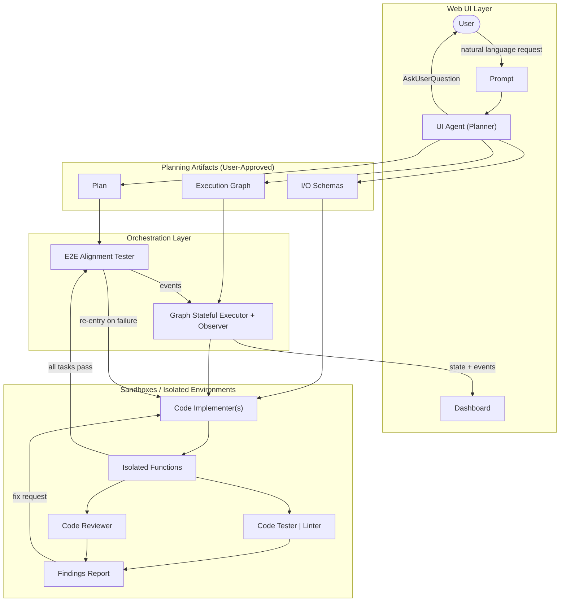
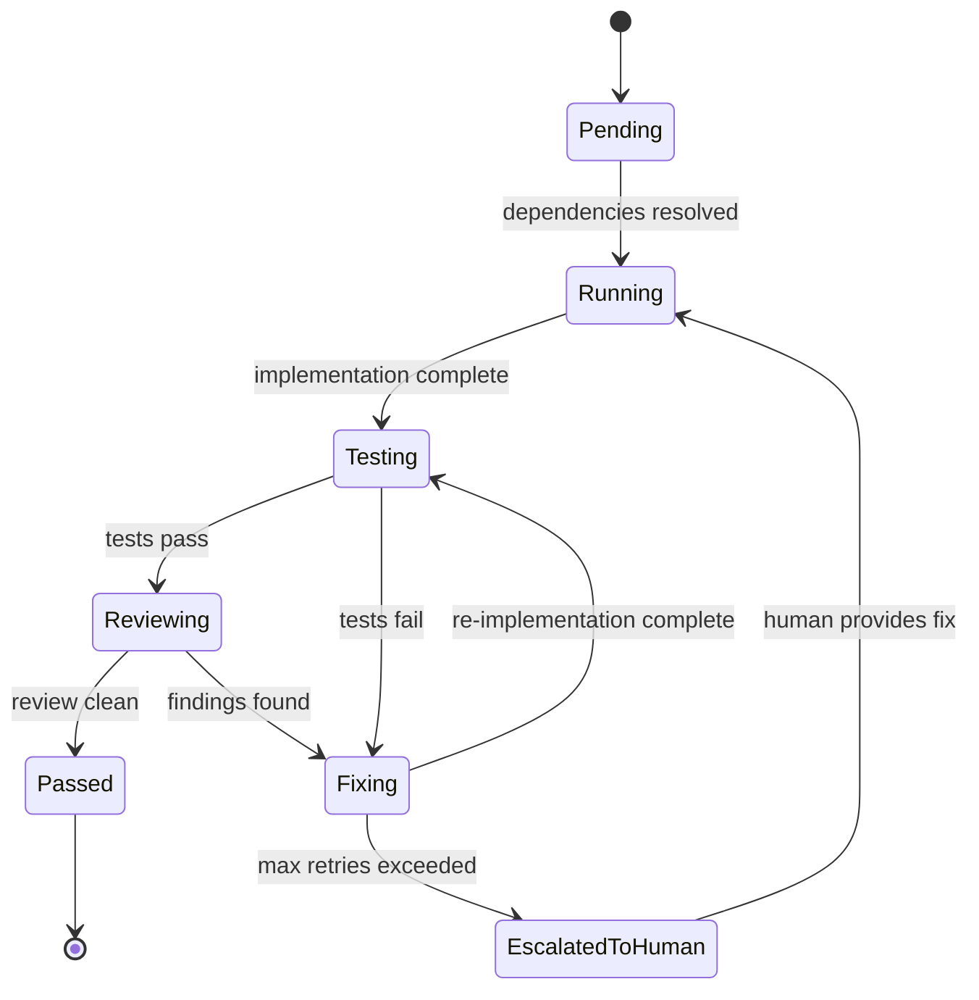
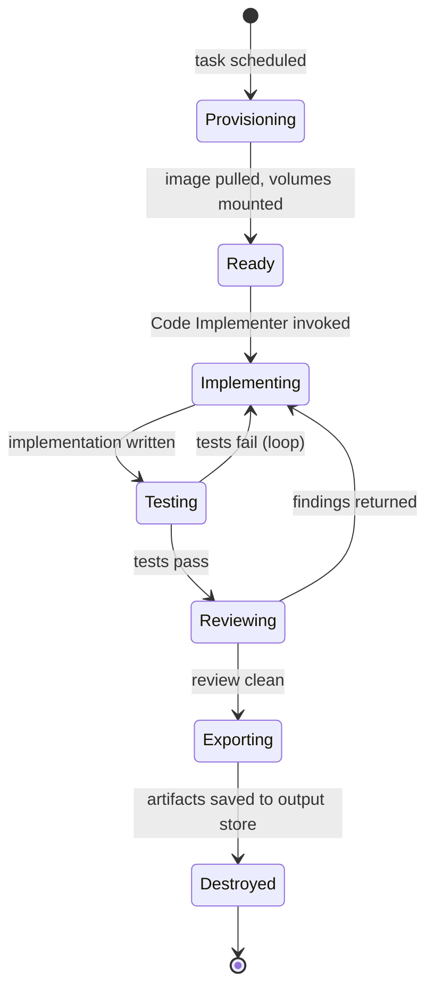
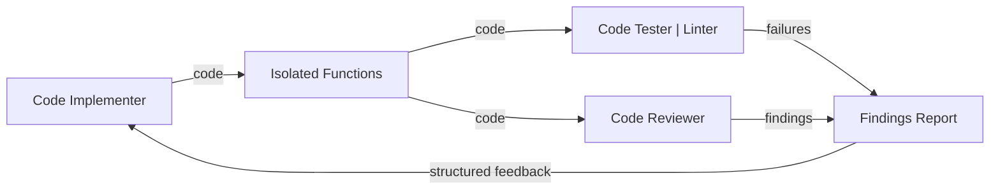
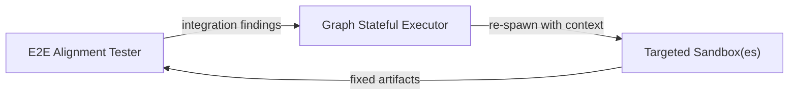

# 0shot Architecture

> **One-shot any backend.** The open-source Lovable & Bolt killer, built for founders who ship fast.

---

## Table of Contents

1. [Project Vision & Problem Statement](#1-project-vision--problem-statement)
2. [Core Principles](#2-core-principles)
3. [System Architecture](#3-system-architecture)
4. [Agent Definitions](#4-agent-definitions)
5. [Data Flow](#5-data-flow)
6. [Execution Graph & DAG Model](#6-execution-graph--dag-model)
7. [I/O Schema Contract System](#7-io-schema-contract-system)
8. [Sandbox Architecture](#8-sandbox-architecture)
9. [Feedback Loops](#9-feedback-loops)
10. [Tech Stack Recommendations](#10-tech-stack-recommendations)
11. [MVP Scope](#11-mvp-scope)
12. [Open Questions](#12-open-questions)

---

## 1. Project Vision & Problem Statement

### The Problem with Today's AI Dev Tools

Tools like Lovable, Bolt, and v0 share a fundamental architectural flaw: they route the *entire* software and infrastructure task through a **single AI context window**. This approach breaks down as complexity grows:

- **Context explosion** — a non-trivial backend (API + DB schema + auth + tests + infra) exhausts context limits, causing models to lose track of earlier constraints.
- **Hallucination cascade** — once the model loses coherence, errors compound. A wrong data type in one function silently propagates through call sites.
- **No parallelism** — everything runs sequentially in one conversation. Complex backends that could be parallelized take linearly longer.
- **Opaque execution** — the user watches a spinner and hopes. There's no visibility into what the AI is actually doing or where it's stuck.
- **No isolation** — a broken implementation in one area contaminates the entire context, making targeted fixes impossible.

### The 0shot Solution

0shot takes a **divide-and-conquer, multi-agent** approach. Instead of one giant AI context, we:

1. **Decompose** the user's request into a set of small, isolated tasks (DAG nodes).
2. **Define contracts** (I/O schemas) between tasks upfront so implementations can be written in parallel without integration risk.
3. **Execute** each task in its own sandboxed agent with a minimal, focused context window.
4. **Verify** each isolated output through automated testing + LLM review before assembly.
5. **Integrate** the verified outputs with an E2E alignment pass against the original plan.

The result: complex backends that would overwhelm a single-context tool are completed reliably, in parallel, with full observability.

---

## 2. Core Principles

| Principle | Description |
|---|---|
| **Isolation-first** | Every task runs in its own context and sandbox. No agent knows about the internals of another — only the agreed schema boundary. |
| **Schema-driven contracts** | Before any code is written, I/O schemas are defined and approved by the user. These schemas are the single source of truth that decouples parallel implementers. |
| **Minimal context per agent** | Each agent receives only what it needs: the task spec, its I/O schema, and relevant dependencies. Context windows stay small and coherent. |
| **Parallel execution** | Independent tasks in the DAG run concurrently. A 15-task backend doesn't run in 15 steps — it runs in `critical_path_length` steps. |
| **Human-in-the-loop planning** | The user approves the Plan, I/O Schemas, and Execution Graph before a single line of code is written. Misalignment is caught at planning time, not after hours of generation. |
| **Feedback loops over retries** | Failures are routed back through structured feedback (Findings Reports) rather than naive retries. Each loop pass carries richer context than the last. |
| **Observability by default** | Every agent emits structured events. The Dashboard reflects real-time execution state, not a black box. |

---

## 3. System Architecture

### High-Level Overview



### Layer Descriptions

#### Web UI Layer
The user-facing surface. Accepts natural language requests, renders the planning artifacts for review, and displays the real-time execution dashboard. The UI Agent can issue clarification requests back to the user (`AskUserQuestion`) before committing to a plan.

#### UI Agent (Planner)
The central orchestrator and the system's most capable LLM call. Responsible for transforming a vague user request into three precise, reviewable artifacts: a Plan, I/O Schemas, and an Execution Graph. Nothing executes until the user approves all three.

#### Graph Stateful Executor + Observer
Interprets the Execution Graph as a runnable DAG. Schedules tasks, manages dependency resolution, tracks state for each node (pending / running / passed / failed / retrying), and emits structured events consumed by the Dashboard and the E2E Alignment Tester.

#### Sandboxes / Isolated Environments
Each node in the Execution Graph spawns its own isolated environment containing a Code Implementer agent, a testing/linting pipeline, and a Code Reviewer agent. Environments are ephemeral and purpose-scoped.

#### E2E Alignment Tester
After all sandbox nodes report success, this agent assembles the full output, runs integration tests, and validates against the original Plan. If alignment fails, it generates targeted re-entry requests back into specific sandbox nodes.

---

## 4. Agent Definitions

### 4.1 UI Agent (Planner)

| Field | Detail |
|---|---|
| **Role** | Orchestrator and planner. Translates a natural language request into a structured execution plan with data contracts. |
| **Inputs** | User prompt, clarification responses, optional existing codebase context |
| **Outputs** | `Plan` (markdown), `I/O Schemas` (JSON Schema / TypeSpec / Pydantic), `Execution Graph` (DAG spec in JSON/YAML) |
| **LLM Requirements** | Highest capability model (Claude Opus 4.6 or equivalent). Needs strong reasoning for decomposition, schema design, and dependency modeling. Extended context for large requests. |
| **Failure Modes** | Over-decomposition (too many tasks → overhead), under-decomposition (tasks too large → context explosion in implementers), incorrect dependency edges (deadlock or missed parallelism), schema gaps (missing fields discovered during implementation) |
| **Retry Strategy** | On user rejection of plan artifacts, the UI Agent receives structured feedback and re-plans. No auto-retry — human approval gates each attempt. |

### 4.2 Code Implementer

| Field | Detail |
|---|---|
| **Role** | Implements a single isolated task (function, service, module) within its sandbox. Focuses only on satisfying its assigned I/O schema. |
| **Inputs** | Task spec (from Plan), input/output schema, dependency schemas (read-only), language/framework constraints, Findings Report (on re-entry) |
| **Outputs** | Source code files for the isolated function/module, unit test stubs |
| **LLM Requirements** | Strong code generation (Claude Sonnet 4.6 or equivalent). Small, focused context — typically < 8k tokens. |
| **Failure Modes** | Schema non-compliance, hallucinated dependencies not in the approved graph, side effects that leak outside the sandbox boundary, incomplete implementation |
| **Retry Strategy** | Receives Findings Report with specific violations. Re-implements with findings in context. Max retries configurable (default: 3). Escalation to human on persistent failure. |

### 4.3 Code Tester | Linter

| Field | Detail |
|---|---|
| **Role** | Automated (non-LLM) pipeline that validates implemented code against the I/O schema and runs static analysis. |
| **Inputs** | Implemented code, I/O schema, test configuration, linting rules |
| **Outputs** | Findings Report (structured list of failures: schema violations, type errors, lint errors, failing test cases) |
| **LLM Requirements** | None for primary path. Optional LLM call to generate additional edge-case tests from schema. |
| **Failure Modes** | Test environment misconfiguration, schema validation library limitations, false positives from overly strict linting |
| **Retry Strategy** | N/A — deterministic. Failures are routed to Code Implementer via Findings Report. |

### 4.4 Code Reviewer

| Field | Detail |
|---|---|
| **Role** | LLM-based review of the implemented code for correctness, security, maintainability, and schema compliance beyond what automated tests catch. |
| **Inputs** | Implemented code, I/O schema, task spec, automated test results |
| **Outputs** | Findings Report (structured: severity, category, description, suggested fix per finding) |
| **LLM Requirements** | Mid-tier capability (Claude Sonnet 4.6). Focused context — only the task scope. Security and code quality reasoning required. |
| **Failure Modes** | False positives blocking otherwise correct code, missed security issues, inconsistent severity ratings |
| **Retry Strategy** | N/A — reviewer produces findings; implementer acts on them. If reviewer consistently blocks correct code, escalate to human review. |

### 4.5 E2E Alignment Tester

| Field | Detail |
|---|---|
| **Role** | Assembles all passed isolated implementations, runs integration tests across the assembled system, and validates the final output against the original Plan and user intent. |
| **Inputs** | All passed isolated functions, integration test specs, original Plan, I/O Schemas |
| **Outputs** | Pass/fail verdict, integration Findings Report (maps failures to specific task nodes), final assembled codebase on pass |
| **LLM Requirements** | High capability (Claude Opus 4.6 or equivalent). Must reason across the full system, not just individual components. |
| **Failure Modes** | Integration failures due to schema drift (impl diverged from schema), missing glue code between components, plan drift (implementation technically correct but misses original intent) |
| **Retry Strategy** | Generates targeted re-entry requests for specific DAG nodes. Those nodes re-enter the sandbox loop with the integration failure as additional context. |

---

## 5. Data Flow

Step-by-step walkthrough of a complete request lifecycle.

```mermaid
sequenceDiagram
    actor User
    participant UI as Web UI
    participant UIA as UI Agent
    participant GSE as Graph Stateful Executor
    participant SB as Sandbox (per task)
    participant E2E as E2E Alignment Tester
    participant Dash as Dashboard

    User->>UI: "Build me a REST API for a task manager with auth"
    UI->>UIA: Prompt + context
    UIA-->>UI: AskUserQuestion (e.g., "JWT or session auth?")
    UI-->>User: Clarification prompt
    User-->>UI: "JWT, PostgreSQL, Python/FastAPI"
    UI->>UIA: Updated context

    UIA->>UI: Plan (draft)
    UIA->>UI: I/O Schemas (draft)
    UIA->>UI: Execution Graph (DAG, draft)
    UI-->>User: Review artifacts

    User-->>UI: Approve / request changes
    UI->>UIA: Change feedback (if any)
    Note over UIA: Re-plans if rejected; loops until approved

    UI->>GSE: Approved Execution Graph + Schemas
    GSE->>Dash: emit(graph_loaded, node_count=15)

    loop For each ready node in DAG (parallel)
        GSE->>SB: Spawn sandbox(task_id, spec, schemas)
        GSE->>Dash: emit(task_started, task_id)
        SB->>SB: Code Implementer generates code
        SB->>SB: Code Tester | Linter validates
        SB->>SB: Code Reviewer reviews

        alt Tests pass, review clean
            SB->>GSE: task_complete(task_id, artifacts)
            GSE->>Dash: emit(task_passed, task_id)
        else Findings found
            SB->>SB: Findings Report → Code Implementer
            Note over SB: Retry loop (max N times)
            SB->>GSE: task_complete(task_id, artifacts)
            GSE->>Dash: emit(task_passed, task_id)
        end
    end

    GSE->>E2E: All tasks passed — trigger integration
    GSE->>Dash: emit(integration_started)
    E2E->>E2E: Assemble system, run integration tests
    E2E->>E2E: Validate against Plan

    alt Integration passes
        E2E->>GSE: integration_complete(success)
        GSE->>Dash: emit(build_complete)
        Dash-->>User: Final output + download
    else Integration fails
        E2E->>GSE: integration_failed(findings_per_node)
        GSE->>Dash: emit(reentry_triggered, nodes=[...])
        loop Targeted re-entry
            GSE->>SB: Re-spawn affected sandbox(es) with integration findings
        end
    end
```

### State Machine for a Task Node



---

## 6. Execution Graph & DAG Model

### Graph Specification Format

The Execution Graph is a JSON document produced by the UI Agent and consumed by the Graph Stateful Executor.

```json
{
  "graph_id": "uuid-v4",
  "created_at": "ISO-8601",
  "language": "python",
  "framework": "fastapi",
  "nodes": [
    {
      "id": "task_001",
      "label": "Define User model + DB schema",
      "type": "implementation",
      "io_schema_ref": "schemas/user.json",
      "dependencies": [],
      "estimated_complexity": "low"
    },
    {
      "id": "task_002",
      "label": "Implement JWT auth middleware",
      "type": "implementation",
      "io_schema_ref": "schemas/auth.json",
      "dependencies": ["task_001"],
      "estimated_complexity": "medium"
    },
    {
      "id": "task_003",
      "label": "Implement task CRUD endpoints",
      "type": "implementation",
      "io_schema_ref": "schemas/tasks.json",
      "dependencies": ["task_001", "task_002"],
      "estimated_complexity": "medium"
    }
  ],
  "edges": [
    { "from": "task_001", "to": "task_002" },
    { "from": "task_001", "to": "task_003" },
    { "from": "task_002", "to": "task_003" }
  ]
}
```

### Dependency Resolution & Parallelism

The Graph Stateful Executor uses **topological sort** (Kahn's algorithm) to derive execution waves:

```
Wave 0 (parallel): task_001
Wave 1 (parallel): task_002, task_004, task_005   ← all depend only on task_001
Wave 2 (parallel): task_003, task_006             ← depend on wave 1 tasks
...
```

Key properties:
- A node enters `Running` state only when **all** its `dependencies` are in `Passed` state.
- Nodes with no dependencies are immediately eligible (Wave 0).
- The executor tracks a **ready queue** — whenever a node passes, it checks if any successors are now unblocked.
- Maximum concurrency is bounded by a configurable `max_parallel_sandboxes` setting (default: 10) to control cost.

### DAG Invariants (enforced at planning time)

- No cycles (validated before user approval).
- Every node has exactly one `io_schema_ref`.
- All referenced schemas exist in the schema registry.
- The graph has exactly one set of terminal nodes (nodes with no outgoing edges) — these feed into the E2E Alignment Tester.

---

## 7. I/O Schema Contract System

### Purpose

I/O schemas are the **only** communication contract between parallel implementers. A Code Implementer never reads another task's source code — it only reads the output schema of its upstream dependencies. This hard boundary is what makes parallelism safe.

### Schema Format

Schemas are defined in **JSON Schema** (primary) with optional Pydantic model generation for Python targets.

```json
// schemas/auth.json
{
  "$schema": "https://json-schema.org/draft/2020-12/schema",
  "$id": "schemas/auth",
  "title": "Auth",
  "description": "JWT authentication contract",
  "functions": {
    "create_access_token": {
      "input": {
        "type": "object",
        "properties": {
          "user_id": { "type": "string", "format": "uuid" },
          "expires_delta": { "type": "integer", "description": "seconds" }
        },
        "required": ["user_id"]
      },
      "output": {
        "type": "object",
        "properties": {
          "token": { "type": "string" },
          "expires_at": { "type": "string", "format": "date-time" }
        },
        "required": ["token", "expires_at"]
      }
    },
    "verify_token": {
      "input": {
        "type": "object",
        "properties": {
          "token": { "type": "string" }
        },
        "required": ["token"]
      },
      "output": {
        "oneOf": [
          {
            "type": "object",
            "properties": {
              "valid": { "const": true },
              "user_id": { "type": "string", "format": "uuid" }
            }
          },
          {
            "type": "object",
            "properties": {
              "valid": { "const": false },
              "error": { "type": "string" }
            }
          }
        ]
      }
    }
  }
}
```

### Schema Lifecycle

```
UI Agent generates schemas
        ↓
User reviews & approves schemas
        ↓
Schemas committed to schema registry (immutable after approval)
        ↓
Code Implementer receives: task schema + dependency schemas (read-only)
        ↓
Code Tester validates implementation output against schema (jsonschema validation)
        ↓
E2E Tester validates cross-schema integration (dependency consumers receive valid inputs)
```

### Schema Validation Rules

- **Structural validation**: Output of a function must satisfy its declared output schema (checked by Code Tester).
- **Consumer validation**: If task B depends on task A, then the output of A's functions must be assignable to the input of B's consuming functions (checked at planning time and by E2E Tester).
- **No implicit any**: All properties must have explicit types. Schemas with `{}` (unrestricted object) are rejected at planning time.
- **Required fields**: The `required` array must be exhaustive — optional fields must be explicitly marked optional.

### Schema Registry

A lightweight key-value store mapping `schema_id → schema_document`. Schemas are:
- Immutable after user approval (append-only log).
- Versioned if re-planning is triggered.
- Accessible to all agents in read-only mode.

---

## 8. Sandbox Architecture

### Sandbox Requirements

Each sandbox must provide:
1. **Execution isolation** — a task's code cannot read or write another task's files.
2. **Schema access** — read-only access to the schema registry.
3. **Network isolation** — no outbound network (prevents LLM hallucinating API calls to external services during implementation).
4. **Reproducible environment** — deterministic dependency installation.
5. **Ephemeral lifecycle** — sandbox is created on task start, destroyed (or archived) on task completion.

### Implementation Options

#### Option A: Docker Containers (Recommended for MVP)

```
┌─────────────────────────────────────┐
│  Sandbox Container (per task)       │
│                                     │
│  /workspace/                        │
│    task_spec.json                   │
│    schemas/ (read-only volume)      │
│    src/                             │
│      implementation.py              │
│    tests/                           │
│      test_implementation.py         │
│  /runner/                           │
│    run_implementer.sh               │
│    run_tester.sh                    │
│    run_reviewer.sh                  │
└─────────────────────────────────────┘
```

- Base image per language (e.g., `python:3.13-slim`).
- Dependency layer cached by framework (e.g., FastAPI base image).
- `--network=none` for implementation phase; restricted network for test runner only.
- Artifacts exported via mounted output volume before container teardown.

#### Option B: Firecracker MicroVMs (Future — higher isolation, faster startup than Docker)

- Sub-second boot times.
- Kernel-level isolation.
- Ideal when sandbox count scales to 50+ concurrent tasks.

#### Option C: WASM Sandboxes (Future — language-constrained)

- Near-zero overhead.
- Only viable for languages with mature WASM toolchains.
- Not suitable for MVP given tooling maturity.

### Sandbox Lifecycle



### Resource Limits (per sandbox)

| Resource | MVP Default | Notes |
|---|---|---|
| CPU | 2 vCPU | Burst to 4 during test runs |
| Memory | 1 GB | Increase for large dependency graphs |
| Disk | 2 GB | Includes dependency cache |
| Wall-clock timeout | 10 min | Escalate to human on breach |
| LLM calls | 5 per agent phase | Prevents runaway costs |

---

## 9. Feedback Loops

### Loop 1: Implementer ↔ Reviewer (Per-Sandbox)



**Findings Report structure:**

```json
{
  "task_id": "task_002",
  "iteration": 2,
  "findings": [
    {
      "id": "F001",
      "source": "code_tester",
      "severity": "error",
      "category": "schema_violation",
      "description": "create_access_token returned token as int, expected string",
      "location": "src/auth.py:34",
      "suggested_fix": "Cast token to str before returning"
    },
    {
      "id": "F002",
      "source": "code_reviewer",
      "severity": "warning",
      "category": "security",
      "description": "JWT secret read from hardcoded string, should use environment variable",
      "location": "src/auth.py:12",
      "suggested_fix": "Replace with os.environ['JWT_SECRET']"
    }
  ]
}
```

**Loop termination conditions:**
- All findings resolved (sandbox exits with `Passed`).
- Max iterations reached → escalate to human with full iteration history.
- Human override: user can mark a finding as "accepted risk" to bypass.

### Loop 2: E2E Alignment Tester ↔ Sandbox Re-entry



This loop differs from Loop 1 in that:
- The re-entry finding is **cross-task** — it identifies which task produced an output that caused a downstream integration failure.
- The re-spawned sandbox receives the original task spec + schemas **plus** the integration failure as additional context.
- Only the affected nodes are re-executed; passing nodes are not re-run (their artifacts are cached).

---

## 10. Tech Stack Recommendations

### Core Language

**Python 3.13** for the framework core (orchestrator, executor, schema validation).

Rationale: Mature async ecosystem, strong LLM SDK support (Anthropic SDK), excellent subprocess/container management libraries, type-safe with Pydantic.

### AI / LLM

| Agent | Recommended Model | Rationale |
|---|---|---|
| UI Agent (Planner) | `claude-opus-4-6` | Best reasoning for complex decomposition |
| Code Implementer | `claude-sonnet-4-6` | Strong codegen, lower latency & cost |
| Code Reviewer | `claude-sonnet-4-6` | Strong code understanding |
| E2E Alignment Tester | `claude-opus-4-6` | Cross-system reasoning |

SDK: `anthropic` (Python). Use streaming for real-time Dashboard events.

### Orchestration

| Component | Technology |
|---|---|
| Graph Stateful Executor | **LangGraph** (built-in DAG + state management) or custom `asyncio`-based executor |
| Task queue | **Celery + Redis** (MVP) or **Temporal** (production) |
| Sandbox management | **Docker SDK for Python** (`docker-py`) |
| Schema validation | **jsonschema** + **Pydantic v2** |
| Schema registry | **Redis** or **PostgreSQL** with append-only writes |

### Web UI & Dashboard

| Component | Technology |
|---|---|
| Frontend | **Next.js 15** (App Router) |
| Real-time updates | **Server-Sent Events** (SSE) or **WebSockets** |
| State management | **Zustand** |
| UI components | **shadcn/ui** |
| Plan artifact rendering | Markdown (Plan), JSON Schema viewer (I/O Schemas), custom DAG visualizer (Execution Graph) |

### Infrastructure

| Component | Technology |
|---|---|
| Container runtime | **Docker** (MVP), **Firecracker** (future) |
| Artifact storage | **Local filesystem** (MVP), **S3-compatible** (production) |
| Observability | **OpenTelemetry** + **Prometheus** + **Grafana** |
| API layer | **FastAPI** |

---

## 11. MVP Scope

### In Scope (V0.1)

The V0.1 MVP focuses on proving the core loop end-to-end on a single, well-defined use case: **Python/FastAPI backend generation**.

| Feature | Priority |
|---|---|
| UI Agent: plan + schema + DAG generation | P0 |
| User approval flow for all three artifacts | P0 |
| Graph Stateful Executor (sequential + parallel) | P0 |
| Docker-based sandbox provisioning | P0 |
| Code Implementer agent (Python/FastAPI) | P0 |
| Code Tester: pytest + jsonschema validation | P0 |
| Code Reviewer agent | P0 |
| Findings Report → Implementer feedback loop | P0 |
| E2E Alignment Tester | P0 |
| Basic Dashboard (node states, live log tail) | P1 |
| Schema registry (Redis) | P1 |
| AskUserQuestion in UI Agent | P1 |
| Max retry escalation to human | P1 |

### Out of Scope (V0.2+)

| Feature | Notes |
|---|---|
| Multi-language support (TypeScript, Go, etc.) | Requires per-language sandbox base images and test runners |
| Firecracker / WASM sandboxes | Replace Docker in V0.3 for performance |
| Frontend generation | Pure backend focus for MVP |
| Database migration generation | Dependent on DB schema task completing first |
| CI/CD pipeline generation | Post-MVP |
| Collaborative multi-user sessions | V0.2 |
| Cost estimation pre-execution | V0.2 |
| Self-hosted LLM support | V0.3 |

### MVP Success Criteria

A successful V0.1 can take this input:

> "Build a REST API for a task manager with JWT auth, PostgreSQL, and CRUD for tasks and users. Python/FastAPI."

And produce a runnable FastAPI application with:
- Working `/auth` (register, login, refresh) endpoints.
- Working `/tasks` and `/users` CRUD endpoints.
- PostgreSQL models via SQLAlchemy.
- Pytest test suite with > 80% coverage.
- All endpoints validated against the approved I/O schemas.

---

## 12. Open Questions

These decisions must be resolved before or during V0.1 development:

### Architecture Decisions

| # | Question | Options | Recommendation |
|---|---|---|---|
| OQ-1 | **Executor implementation**: Build custom async DAG executor or adopt LangGraph? | Custom `asyncio`, LangGraph, Temporal | LangGraph for MVP — handles state + DAG natively; migrate to Temporal if scale requires it |
| OQ-2 | **Schema format**: JSON Schema only, or support TypeSpec / Protobuf? | JSON Schema, TypeSpec, Protobuf, Pydantic-first | JSON Schema for MVP (broadest tooling support); TypeSpec for V0.2 |
| OQ-3 | **Sandbox networking**: Should Code Tester have outbound network access to install packages, or pre-bake all deps? | Pre-baked images, runtime pip install, uv with cache | Pre-baked per-framework images + `uv` for fast installs with a restricted allowlist |
| OQ-4 | **Artifact storage**: Where do sandbox outputs live between tasks? | Local disk, Redis, S3, database | Local filesystem for MVP, abstract behind a `ArtifactStore` interface |
| OQ-5 | **Schema immutability**: Can the user amend schemas after approval but before execution starts? | Hard-lock, soft-lock with re-validation, free edits | Soft-lock: allow amendments with automatic re-validation of dependency graph |

### Product Decisions

| # | Question | Notes |
|---|---|---|
| OQ-6 | **Monetization model**: API key bring-your-own vs. managed LLM cost? | Directly impacts cost estimation UX |
| OQ-7 | **Output delivery**: Zip download, GitHub push, or in-browser preview? | GitHub push is highest value but requires OAuth scope |
| OQ-8 | **Plan granularity**: How small should a single task node be? (function-level vs. module-level) | Too fine → overhead; too coarse → context explosion. Needs empirical calibration. |
| OQ-9 | **Human escalation UX**: When max retries are hit, what does the user see? A diff? A raw error? An AI-summarized explanation? | Affects user trust significantly |
| OQ-10 | **Multi-turn re-planning**: If E2E fails 3 times, should the UI Agent re-decompose the problem entirely? | Requires defining when a re-plan is better than a targeted fix |

---

*Document version: 0.1.0 — Initial kickoff architecture*
*Last updated: 2026-02-28*
